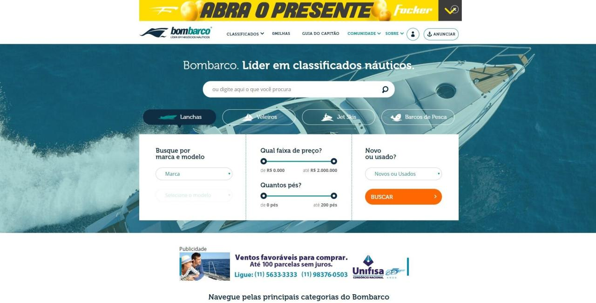

# Project Name
> [Bombarco](http://bombarco.com.br)

## Table of contents
* [General info](#general-info)
* [Screenshots](#screenshots)
* [Technologies](#technologies)
* [Setup](#setup)
* [Features](#features)
* [Status](#status)
* [Contact](#contact)

## General info
Platform created in 2014 with a focus on the nautical business

## Screenshots

## Technologies
* PHP - Yii framework
* Vue Js
* jQuery
* MySQL
* CDN - Cloudflare
* Payment gateway integration
* PHP Unit test

## Status
I no longer work on the project, this is only a old version

## Contact
[@jorgepezzuol](https://www.linkedin.com/in/jorge-pezzuol/)
